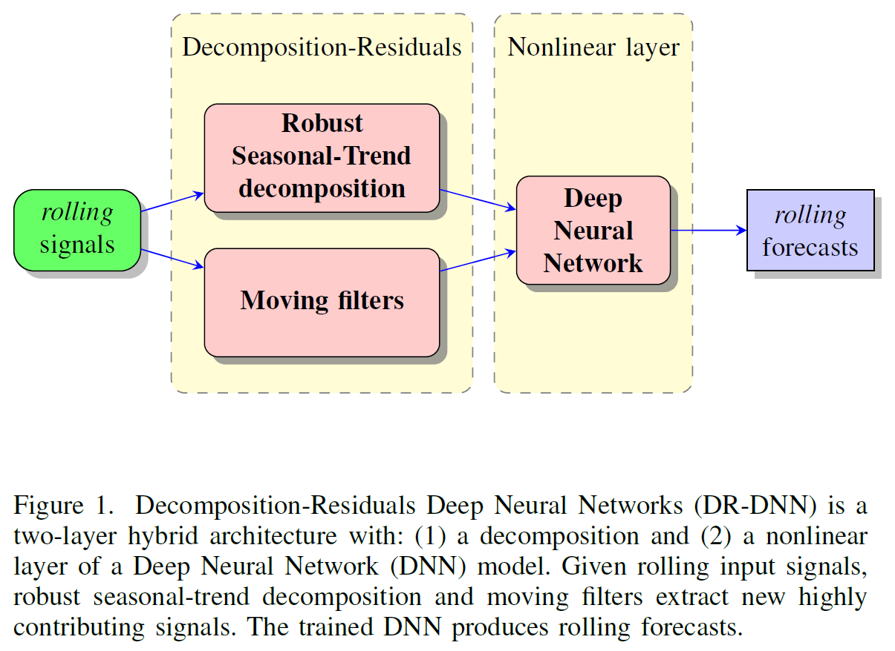

# DR-DNN
## Decomposition-Residuals Neural Networks: Hybrid system identification applied to electricity demand forecasting

#### Konstantinos Theodorakos  
*Katholieke Universiteit Leuven*  
*Student of the Master Artificial Intelligence: Engineering and Computer Science*  
*Faculty of Engineering Science*  
*Departments of Computer Science & Electrical Engineering, ESAT-STADIUS*  
*Kasteelpark Arenberg 10*  
*Leuven (Heverlee), Belgium*  
*Email: madks@hotmail.com*

### Keywords: electricity demand forecasting, signal decomposition, deep neural networks, system identification

*Note: Work in progress.*
