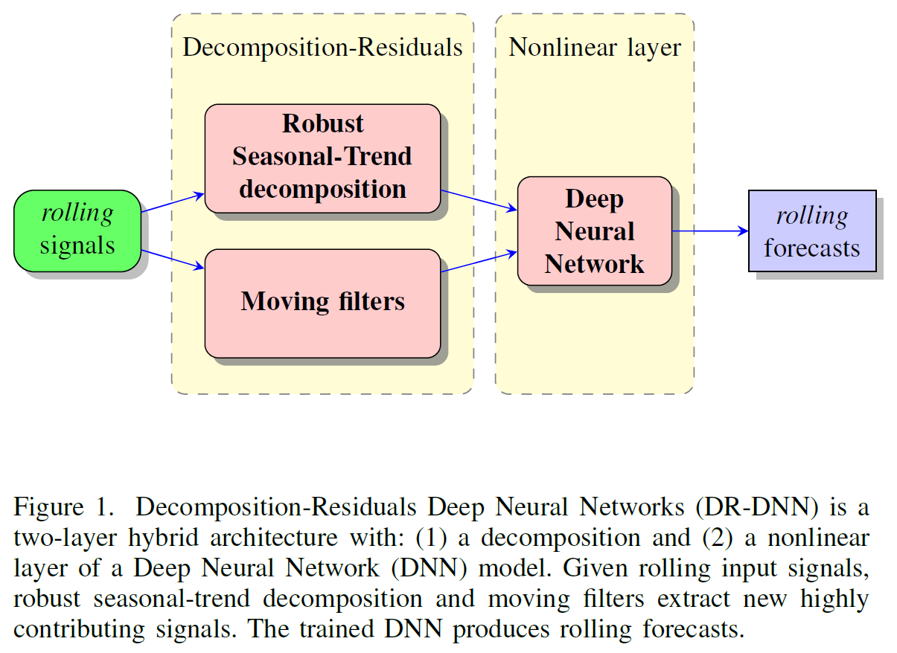

# DR-DNN
## Decomposition-Residuals Neural Networks: Hybrid system identification applied to electricity demand forecasting

#### Konstantinos Theodorakos  
*KU Leuven*
*Faculty of Engineering Science*  
*Department of Electrical Engineering (ESAT)*

*STADIUS Center for Dynamical Systems, Signal Processing and Data Analytics*
*Kasteelpark Arenberg 10*
*Leuven, Belgium*

*Email: madks@hotmail.com*

##### *Note: This source code repository is a work in progress.*

## Abstract
Day-ahead energy forecasting systems struggle to provide accurate demand predictions due to pandemic mitigation measures. Decomposition-Residuals Deep Neural Networks (DR-DNN) are hybrid point-forecasting models that can provide more accurate electricity demand predictions than single models within the COVID-19 era. DR-DNN is a novel two-layer hybrid architecture with: a decomposition and a nonlinear layer. Based on statistical tests, decomposition applies robust signal extraction and filtering of input data into: trend, seasonal and residuals signals. Utilizing calendar information, temporal signals are added: sinusoidal day/night cycles, weekend/weekday, etc. The nonlinear layer learns unknown complex patterns from all those signals, with the usage of well-established deep neural networks. DR-DNN outperformed baselines and state-of-the-art deep neural networks on next-day electricity forecasts within the COVID-19 era (from September 2020 to February 2021), both with fixed and Bayesian optimized hyperparameters. Additionally, model interpretability is improved, by indicating which endogenous or exogenous inputs contribute the most to specific hour-ahead forecasts. Residual signals are very important on the first hour ahead, whereas seasonal patterns on the 24th. Some calendar features also ranked high: whether it is day or night, weekend or weekday and the hour of the day. Temperature was the most important exogenous factor.

#### Keywords: electricity demand forecasting, signal decomposition, deep neural networks, system identification




## How to cite DR-DNN
Authors of scientific papers including methods/techniques inspired by Decomposition-Residuals Neural Networks are encouraged to cite this work as follows:

```xml
@ARTICLE{9690165,
  author={Theodorakos, Konstantinos and Agudelo, Oscar Mauricio and Espinoza, Marcelo and De Moor, Bart},
  journal={IEEE Open Access Journal of Power and Energy}, 
  title={Decomposition-Residuals Neural Networks: Hybrid System Identification Applied to Electricity Demand Forecasting}, 
  year={2022},
  volume={9},
  number={},
  pages={241-253},
  doi={10.1109/OAJPE.2022.3145520}}
```
